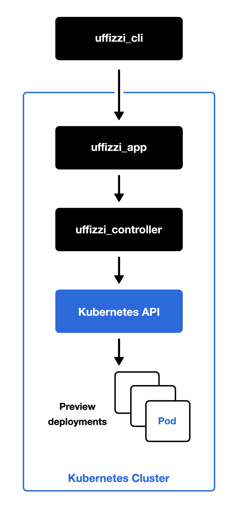

# Uffizzi App

**The primary REST API for creating and managing previews**

While Uffizzi App provides a documented REST API for anyone to use, it's most valuable when used with the open-source [`uffizzi_cli`](https://github.com/UffizziCloud/uffizzi_cli) or [GitHub Action](https://github.com/UffizziCloud/preview-action).

## Uffizzi Overview

Uffizzi is an open-source engine for creating lightweight, ephemeral preview environments for APIs and full-stack applications. Uffizzi enables teams to preview new features before merging and to mitigate the risk of introducing regressions into a codebase. Each preview gets a shareable URL that's updated when you push new commits or image tags, so teams can provide continual feedback during the iterative development process. Previews can be configured to expire at a set time or be destroyed when a pull request is closed, so environments exist only as long as they are needed. Uffizzi helps to parallelize new feature efforts by overcoming the bottleneck of shared development environments.

While Uffizzi depends on Kubernetes, it does not require end-users to interface with Kubernetes directly. Uffizzi leverages Docker Compose as its configuration file format, so developers need not write Kubernetes manifests nor even know about Kubernetes.

Uffizzi is designed to integrate with any CI/CD system.

## Installation

See the [Helm chart and installation guide](charts/uffizzi-app/README.md) for installing Uffizzi on your own Kubernetes cluster.

Once Ufizzi is installed, you can use the [Uffizzi CLI](https://github.com/UffizziCloud/uffizzi_cli) to create and manage previews. Additionally, you can continuously deploy previews of your branches using [the GitHub Action](https://github.com/UffizziCloud/preview-action).

## Uffizzi Architecture


Uffizzi consists of the following components:

* Uffizzi App (this repository) - The primary REST API for creating and managing Previews
* [Uffizzi Controller](https://github.com/UffizziCloud/uffizzi_controller) - A smart proxy service that handles requests from Uffizzi App to the Kubernetes API
* [Uffizzi CLI](https://github.com/UffizziCloud/uffizzi_cli) - A command-line interface for Uffizzi App

Uffizzi App requires the following external dependencies:

 * Kubernetes (k8s) cluster
 * PostgreSQL database
 * Redis cache

## Controller Design

This `uffizzi_app` acts as a REST API for [`uffizzi_cli`](https://github.com/UffizziCloud/uffizzi_app) interface. It requires [`uffizzi_controller`](https://github.com/UffizziCloud/uffizzi_controller) as a supporting service.

## Uffizzi App Environment Variables

- `RAILS_SECRET_KEY_BASE` - secret_key_base of Rails::Application
- `DATABASE_HOST` - the database hostname (default: 127.0.0.1)
- `DATABASE_USER` - the database username (default: postgres)
- `DATABASE_PASSWORD` - the database password
- `DATABASE_PORT` - the database port (default: 5432)
- `BUNDLE_PATH` - the location of gems for `bundle install` command (not required)
- `GEM_PATH` - the location where gems can be found (not required)
- `GEM_HOME` - where gems will be installed (not required)
- `RAILS_WORKERS_COUNT` - the number of `puma` workers (default: 18)
- `RAILS_THREADS_COUNT` - the number of `puma` threads (default: 5)
- `RAILS_PORT` - the `puma` port (default: 7000)
- `RAILS_ENV` - the rails environment (default: development)
- `SIDEKIQ_CONCURRENCY` - sidekiq concurrency (default: 5)
- `ALLOWED_HOSTS` - allowed hosts for rails app used for Rack::Cors (default: [])
- `APP_URL` - URL of the application
- `REDIS_URL` - URL of a Redis server
- `CONTROLLER_URL` - URL of the controller application (default: http://controller:8080)
- `CONTROLLER_LOGIN` - the login of the controller application (default: '')
- `CONTROLLER_PASSWORD` - the password of the controller application (default: '')

# Test Uffizzi App Locally

If you want to run Uffizzi on your workstation instead of using [the Helm chart](charts/uffizzi-app/README.md), then you can run it using Docker Compose.

## Prepare

```bash
docker-compose run --rm web bash -c "bundle install && bundle exec rails db:setup"
docker-compose up
```

## Create a new user

Run the following command and follow instructions:

```bash
docker-compose run --rm web bash -c "rake uffizzi_core:create_user"
```

or run the command with environment variables:

- `UFFIZZI_USER_EMAIL` - user's email
- `UFFIZZI_USER_PASSWORD` - user's password
- `UFFIZZI_PROJECT_NAME` - user's project name

```bash
docker-compose run --rm -e UFFIZZI_USER_EMAIL=user@uffizzi.com -e UFFIZZI_USER_PASSWORD=password -e UFFIZZI_PROJECT_NAME=project web bash -c "rake uffizzi_core:create_user"
```

## Connect from uffizzi-cli to the app

```bash
docker-compose run --rm gem bash
bundle exec uffizzi login --hostname http://web:7000 -u admin@uffizzi.com
```

## API Documentation

* [Development](http://lvh.me:7000/api-docs/index.html)

Rebuild documentation locally:

```bash
docker-compose run --rm core bash
bundle exec rake core:generate_docs
```

# Health checks

The default health check uri is `health_check`. To use a custom uri please add the `HEALTH_CHECK_URI` environment variable to the docker-compose.yml

# Contributing

Please see [`CONTRIBUTING.md`](CONTRIBUTING.md) within this repository.

Bug reports and pull requests are welcome on GitHub at https://github.com/UffizziCloud/uffizzi_app.
